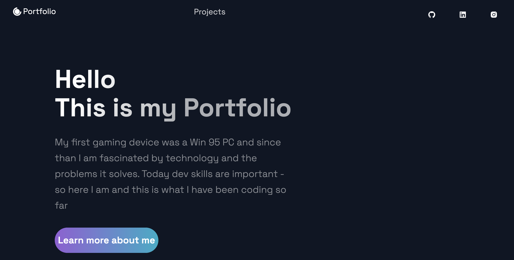

## My-Portfolio

[Link to deployed application](https://alexanderpuschkin.herokuapp.com/)

[Link to the github Repo](https://github.com/alexanderpuschkinberlin/my-portfolio)

## Screenshot

## Table of Contents

- [Description](#description)

- [Installation](#installation)

- [License](#license)

  ## Description

  This is my portfolio based on a react js framework called next.js. The page is deployed on github. This portfolio page covers the recent projects from the coding bootcamp at the ESMT Berlin.

  ## Installation

  To install the dependencies for this application, the user simply needs to clone the repository and then run the command "npm install". This will install all necessary dependencies since they are all included in the package.json. Afterwards just use the comammd "npm run start". This will open a localhost page on your computer.

  ## License

  
